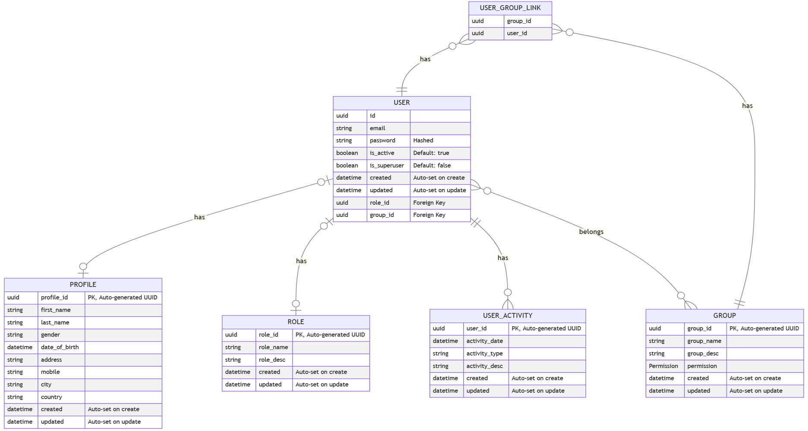

<p align="center">
  
</p>

<h1 align="center">FastAPI HTMX</h1>

<p align="center">
  Web App providing boilerplate implementation for user management, roles, groups, and CRUD operations using  HTMX, FastAPI and AlpineJS for rapid prototyping and without worrying for the user management.
</p>

## External Libraries Used

This project leverages several external libraries to provide a robust and efficient solution. Below is a brief description of each library along with a link to their documentation:

- [FastAPI](https://fastapi.tiangolo.com/) (v0.103.2): A modern, fast (high-performance), web framework for building APIs and serving HTML templates with Python 3.6+ based on standard Python type hints.
- [SQLAlchemy](https://www.sqlalchemy.org/) (v2.0.21): The Python SQL toolkit and Object Relational Mapper that gives application developers the full power and flexibility of SQL.
- [FastAPI Users](https://fastapi-users.github.io/fastapi-users/) (v12.1.2): Ready-to-use and customizable users management for FastAPI.
- [Uvicorn](https://www.uvicorn.org/) (v0.23.2): A lightning-fast ASGI server implementation, using `uvloop` and `httptools`.
- [AioSQLite](https://github.com/omnilib/aiosqlite) (v0.19.0): A library for SQLite with asyncio support.
- [Jinja2](https://palletsprojects.com/p/jinja/) (v3.1.2): A modern and designer-friendly templating language for Python.
- [HTTPX](https://www.python-httpx.org/): A next-generation HTTP client for Python.
- [NH3](https://github.com/Th3Whit3Wolf/nh3) (v3.1.2): A Python binding to the HTML sanitizer `h3`.
- [Alembic](https://alembic.sqlalchemy.org/en/latest/) (v1.13.1): A lightweight database migration tool for usage with the SQLAlchemy Database Toolkit.
- [AlpineJS](https://alpinejs.dev/) (loaded from CDN): A rugged, minimal framework for composing JavaScript behavior in your HTML templates.
- [Flowbite](https://flowbite.com/) (loaded from CDN): A component library built on top of Tailwind CSS for building modern web interfaces.
- [Pydantic](https://docs.pydantic.dev/2.0/) (v2.4.2): Data validation and settings management using Python type annotations.

## Features Implemented

- User Authentication and Authorization
- Role Management
- Group Management
- Dashboard for managing users, roles, and groups
- RESTful API endpoints for CRUD operations
- HTML templates for web interface
- Database migrations with Alembic

## To-Do (Future Enhancements)

- Implement a rate limiter to prevent abuse and ensure fair usage
- Integrate MinIO object storage for efficient file saving and management
- Add functionality to allow users to update their passwords
- Implement a password reset feature on the login page
- Develop a logging service to track and analyze user activity
- Implement CSRF protection to enhance security

## Setting Up the Project

### Creating the `.env` File

Create a `.env` file in the root directory of the project and add the following environment variables:

```
DATABASE_URL="sqlite+aiosqlite:///./users.db"
SECRET_KEY=your_secret_key
```

Replace `your_secret_key` with a strong secret key for your application.

### Running the Project

1. **Clone the repository:**

   ```sh
   git clone https://github.com/yourusername/project-management.git
   cd project-management
   ```

2. **Install dependencies:**
   If you are using `poetry`, run:

   ```sh
   poetry install
   ```

   If you are using `pip`, run:

   ```sh
   pip install -r requirements.txt
   ```

3. **Run database migrations:**

   ```sh
   alembic upgrade head
   ```

4. **Start the application:**
   If you are using `poetry`, run:

   ```sh
   poetry run uvicorn main:app --reload
   ```

   If you are using `uvicorn` directly, run:

   ```sh
   uvicorn main:app --reload
   ```

5. **Access the application:**
   Open your web browser and navigate to `http://127.0.0.1:8000`.

## Contributing

Contributions are welcome! Please open an issue or submit a pull request for any changes.

## ER Diagram

Here's the Entity-Relationship (ER) diagram for database:



## License

This project is licensed under the MIT License. See the [LICENSE](LICENSE) file for details.
